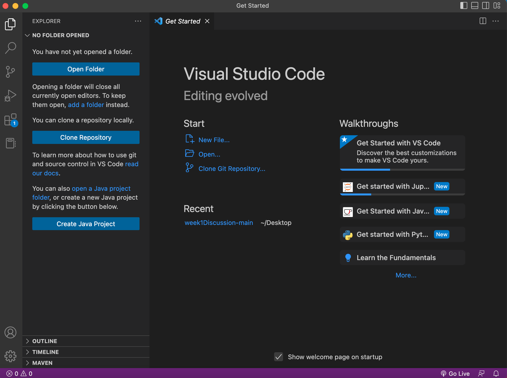

# CSE 15L Week 1 Setup

## Installing Visual Studio Code
1. Go to the VS Code website https://code.visualstudio.com/, and follow the instructions to download and install the specific version for your computer's operating systems.
2. After it is installed, you will be able to open a window that looks similar to this:

## Remotely Connecting
1. For this section, you will learn how to use VS Code/terminal to connect to a remote computer over the Internet to do work there. Situations where you will have to work elsewhere may occur when working on other systems at different institutions or a future job.
2. Install `git` 
3. To use `ssh`, open a terminal in VS Code and put in the command below, replacing the `zz` with the letters in your course-specific account.

`$ ssh cs15lwi23zz@ieng6.ucsd.edu`

(Don't include the `$`! It's just a convention for how to write commands.)

## Testing Commands
