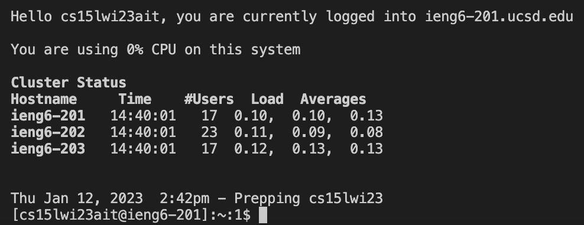

# CSE 15L Week 1 Setup

## Installing Visual Studio Code
1. Go to the VS Code website https://code.visualstudio.com/, and follow the instructions to download and install the specific version for your computer's operating systems.
2. After it is installed, you will be able to open a window that looks similar to this:


## Remotely Connecting
1. For this section, you will learn how to use VS Code/terminal to connect to a remote computer over the Internet to do work there. Situations where you will have to work elsewhere may occur when working on other systems at different institutions or a future job.
2. Install `git` 
3. To use `ssh`, open a terminal in VS Code and put in the command below, replacing the `zz` with the letters in your course-specific account. (Don't include the `$`! It's just a convention for how to write commands.)

`$ ssh cs15lwi23zz@ieng6.ucsd.edu`

4. Because this is your first time connecting to this server, you will receive a message that looks like this:

```
⤇ ssh cs15lwi23zz@ieng6.ucsd.edu
The authenticity of host 'ieng6.ucsd.edu (128.54.70.227)' can't be established.
RSA key fingerprint is SHA256:ksruYwhnYH+sySHnHAtLUHngrPEyZTDl/1x99wUQcec.
Are you sure you want to continue connecting (yes/no/[fingerprint])?
```

5. Type `yes` and press enter. Then, enter your password. The interaction should look like this:

```
# On your client
⤇ ssh cs15lwi23zz@ieng6.ucsd.edu
The authenticity of host 'ieng6-202.ucsd.edu (128.54.70.227)' can't be established.
RSA key fingerprint is SHA256:ksruYwhnYH+sySHnHAtLUHngrPEyZTDl/1x99wUQcec.
Are you sure you want to continue connecting (yes/no/[fingerprint])? 
Password: 
```

On your remote server:



6. You are now connected to the CSE Basement!

## Testing Commands
1. Run some codes `cd`, `ls`, `pwd`, `mkdir`, and `cp` a few times in different ways on both **your computer** and on the **remote computer**.
2. Specific commands to try:
  - cd ~
  - cd
  - ls -lat
  - ls -a
  - ls <directory> where <directory> is /home/linux/ieng6/cs15lwi23/cs15lwi23abc, where the abc is one of the other group members’ username
  - cp /home/linux/ieng6/cs15lwi23/public/hello.txt ~/
  - cat /home/linux/ieng6/cs15lwi23/public/hello.txt
