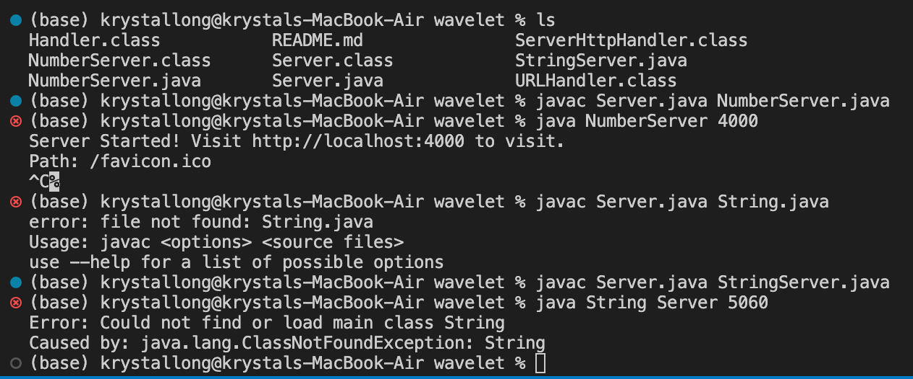

# CSE 15L Week 3 Lab Report 2 - Servers and Bugs
## Part 1

* I couldn't get the webserver to run. I'm pretty sure this is either because I am not on UCSD-PROTECTED, or because I am compiling and running it wrong using the javac and java command in my terminal
* I have the String method where you may pass data in and have it returned something

## Part 2

## Part 3
During Week 3, I was exposed to JUnit for the first time. This is my first CSE class at UCSD, and my most recent coding experience in Java was from 2 years ago. I honestly am unsure on what I was thinking, taking this class before CSE 11 (since I already had credit for it from a concurrent enrollment class). I learned that JUnit is a software used to test methods from java files. It is a great tool to have as a coder to find problems with the code more time efficiently. I still have much learning to do in this class and will have to try my hardest to succeed. I am really sorry that I let you down as you read this Lab Report, grader. Thank you for taking the time to grade this sh*tty report.
